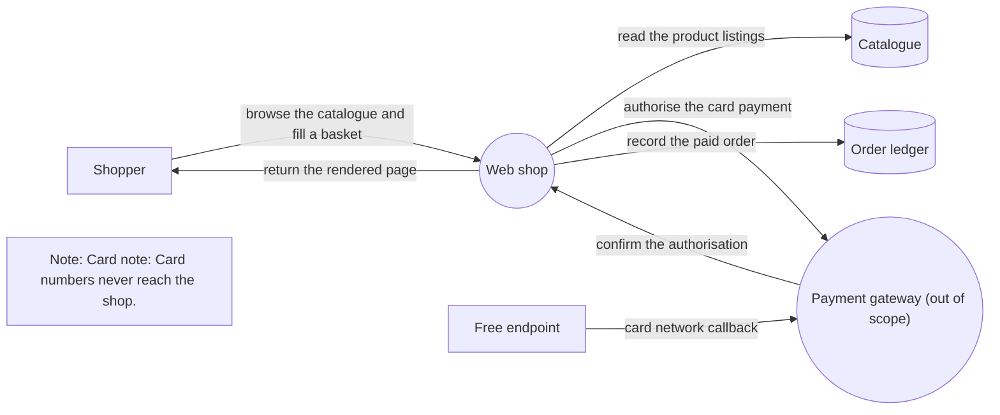
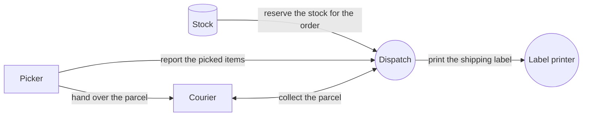

# Two diagrams threat register

## Diagrams

### Taking an order

Trust boundaries not shown: Shop network.

### Shipping an order

Trust boundaries not shown: Warehouse floor.

## Threat register

| Number           | Title                                   | Elements                                                         | Category                                | Severity  | Status        |
| ---------------- | --------------------------------------- | ---------------------------------------------------------------- | --------------------------------------- | --------- | ------------- |
| [1](#threat-1)   | Account takeover by credential stuffing | Shopper, browse the catalogue and fill a basket                  | Spoofing (STRIDE)                       | High      | Open          |
| [2](#threat-2)   | Basket price changed in the page        | Web shop, return the rendered page                               | Tampering (STRIDE)                      | Critical  | Mitigated     |
| [3](#threat-3)   | Unpublished listings readable           | Catalogue, read the product listings                             | Confidentiality (CIA)                   | Medium    | Accepted risk |
| [4](#threat-4)   | Card data disclosed in transit          | The whole model, Payment&#xA;gateway, authorise the card payment | Information disclosure (STRIDE)         | High      | Transferred   |
| [6](#threat-6)   | Shopper denies placing an order         | Order ledger, record the paid order                              | Repudiation (STRIDE)                    | Low       | Mitigated     |
| [7](#threat-7)   | Forged payment callback                 | card network callback                                            | Callback integrity (Payments checklist) | Undecided | Open          |
| [8](#threat-8)   | Stock held by abandoned reservations    | Stock, reserve the stock for the order                           | Denial of service (STRIDE)              | Medium    | Open          |
| [9](#threat-9)   | Courier learns more than the address    | Courier, hand over the parcel                                    | Data disclosure (LINDDUN)               | Low       | Open          |
| [10](#threat-10) | Picker overrides a dispatch hold        | Picker, Dispatch, report the picked items                        | Elevation of privilege (STRIDE)         | High      | Open          |
| [11](#threat-11) | Refund policy abused                    | None                                                             | Integrity (CIA)                         | Low       | Open          |

### Assumptions that apply to the model

- Valid

  The payment provider holds its own card data certification.

- Unconfirmed

  Every courier is vetted by the carrier.

### Threat 1: Account takeover by credential stuffing

- **Elements**: Shopper, browse the catalogue and fill a basket
- **Category**: Spoofing (STRIDE)
- **Severity**: High
- **Status**: Open
- **Flags**: None

**Description**

Reused passwords from another breach sign in as the shopper.

**Mitigations**

- Proposed **Sign-in throttling**

  Throttle sign-in attempts:

  - per account
  - per network address

**Assumptions**

None recorded.

### Threat 2: Basket price changed in the page

- **Elements**: Web shop, return the rendered page
- **Category**: Tampering (STRIDE)
- **Severity**: Critical
- **Status**: Mitigated
- **Flags**: None

**Description**

The page carries the price back with the basket, so an edited page could set its own.

**Mitigations**

- Implemented

  The server prices the basket from the catalogue and ignores any price the page sends.

- Verified **Signed basket**

  The basket token is signed, and a changed token is refused.

**Assumptions**

None recorded.

### Threat 3: Unpublished listings readable

- **Elements**: Catalogue, read the product listings
- **Category**: Confidentiality (CIA)
- **Severity**: Medium
- **Status**: Accepted risk
- **Flags**: None

**Description**

A guessed listing address shows a product before launch:

- its draft price
- its launch date

**Mitigations**

None recorded.

**Assumptions**

None recorded.

### Threat 4: Card data disclosed in transit

- **Elements**: The whole model, Payment
  gateway, authorise the card payment
- **Category**: Information disclosure (STRIDE)
- **Severity**: High
- **Status**: Transferred
- **Flags**: None

**Description**

None recorded.

**Mitigations**

None recorded.

**Assumptions**

- Valid

  The payment provider holds its own card data certification.

### Threat 6: Shopper denies placing an order

- **Elements**: Order ledger, record the paid order
- **Category**: Repudiation (STRIDE)
- **Severity**: Low
- **Status**: Mitigated
- **Flags**: Mitigated without implemented work

**Description**

None recorded.

**Mitigations**

- Proposed

  Write an audit entry with each ledger change.

**Assumptions**

None recorded.

### Threat 7: Forged payment callback

- **Elements**: card network callback
- **Category**: Callback integrity (Payments checklist)
- **Severity**: Undecided
- **Status**: Open
- **Flags**: Rests on an invalidated assumption

**Description**

A callback that is not from the card network marks an order paid.

**Mitigations**

None recorded.

**Assumptions**

- Invalidated

  The card network signs every callback it sends.

### Threat 8: Stock held by abandoned reservations

- **Elements**: Stock, reserve the stock for the order
- **Category**: Denial of service (STRIDE)
- **Severity**: Medium
- **Status**: Open
- **Flags**: None

**Description**

None recorded.

**Mitigations**

- Implemented **Reservation expiry**

  A reservation lapses after thirty minutes, and a hold outlives no reservation.

**Assumptions**

None recorded.

### Threat 9: Courier learns more than the address

- **Elements**: Courier, hand over the parcel
- **Category**: Data disclosure (LINDDUN)
- **Severity**: Low
- **Status**: Open
- **Flags**: None

**Description**

None recorded.

**Mitigations**

None recorded.

**Assumptions**

- Unconfirmed

  Every courier is vetted by the carrier.

### Threat 10: Picker overrides a dispatch hold

- **Elements**: Picker, Dispatch, report the picked items
- **Category**: Elevation of privilege (STRIDE)
- **Severity**: High
- **Status**: Open
- **Flags**: None

**Description**

None recorded.

**Mitigations**

- Implemented **Reservation expiry**

  A reservation lapses after thirty minutes, and a hold outlives no reservation.

**Assumptions**

None recorded.

### Threat 11: Refund policy abused

- **Elements**: None
- **Category**: Integrity (CIA)
- **Severity**: Low
- **Status**: Open
- **Flags**: None

**Description**

Not tied to one element: the policy itself is the weakness.

**Mitigations**

None recorded.

**Assumptions**

None recorded.
